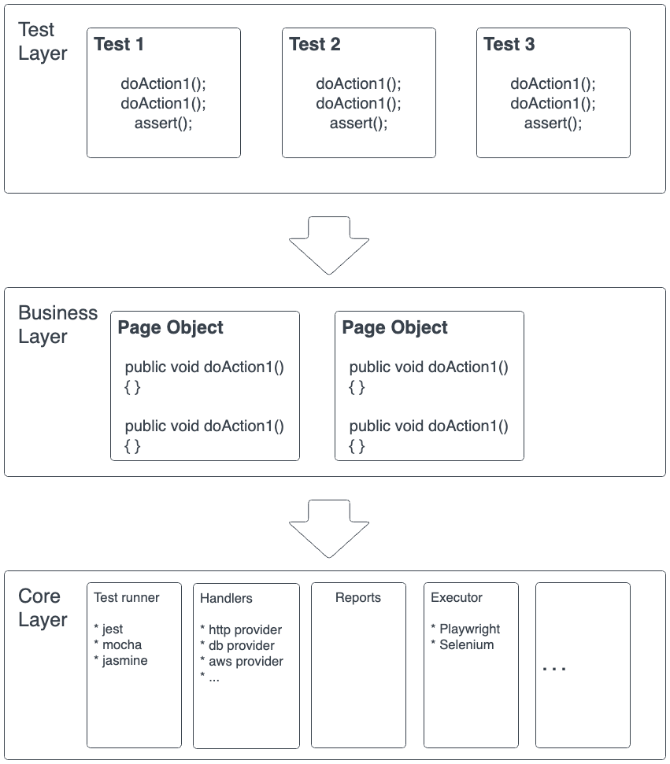

# Test Assignment Senior QA Engineer (JetSites)

## Table of Contents

1. [Introduction](#introduction)
2. [Architecture Overview](#architecture-overview)
3. [Key Components](#key-components)
    - [Test Scripts](#test-scripts)
    - [Test Data](#test-data)
    - [Page Objects](#page-objects)
    - [Test Utilities](#test-utilities)
    - [Test Runner](#test-runner)
4. [Layered Architecture](#layered-architecture)
    - [Presentation Layer](#presentation-layer)
    - [Business Logic Layer](#business-logic-layer)
    - [Data Access Layer](#data-access-layer)
    - [Infrastructure Layer](#infrastructure-layer)
5. [Workflow](#workflow)
6. [Benefits](#benefits)
7. [Best Practices](#best-practices)

## Introduction

The Test Automation Framework with Layered Architecture is designed to provide a structured and scalable approach to automate software testing. This documentation outlines the key components, architecture, and best practices to effectively use the framework for test automation.

## Architecture Overview

The framework follows a clean separation of concerns through a four-layer architecture:
- **Business Logic Layer**
- **Data Access Layer**
- **Infrastructure Layer**

This structure allows independent development and maintenance of components, enhancing test reliability and reducing duplication.

## Key Components

### Test Scripts

Test scripts represent the automated test cases that validate the functionality of the application. These scripts interact with the application through the presentation layer and leverage reusable components.

### Test Data

Test data includes the input values and expected results necessary for executing test scripts. Separating test data from test scripts promotes maintainability and allows for easy updates.

### Page Objects

Page objects abstract the interaction with the user interface elements of the application. They encapsulate the locators and actions, making test scripts more readable and reducing duplication.

### Test Utilities

Test utilities include helper functions, libraries, and tools that support test automation. These utilities handle common functionalities like logging, reporting, and configuration management.

### Test Runner

The test runner orchestrates the execution of test scripts, manages test data, and generates test reports. It plays a crucial role in integrating the different components of the framework.

## Layered Architecture

### Presentation Layer

This layer involves the interaction with the user interface elements of the application. Page objects reside in this layer, providing a clean and modular way to interact with the UI.

### Business Logic Layer

The business logic layer contains the test scripts that drive the application by interacting with the presentation layer. It focuses on validating the application's functionality against the defined test scenarios.

### Data Access Layer

The data access layer manages test data, ensuring separation from the test scripts. This separation facilitates easy maintenance and updates to test data without modifying the test scripts.

### Infrastructure Layer

The infrastructure layer includes test utilities and configurations required for the framework's operation. It provides a foundation for the other layers, handling cross-cutting concerns such as logging and reporting.

## Workflow

1. **Test Scripts** initiate flow via **Page Objects** in the Presentation Layer.
2. **Test Data** is fetched dynamically through the Data Access Layer.
3. **Infrastructure** utilities manage logging, reporting, and environmental configs.
4. **Test Runner** orchestrates the execution of test scripts, manages test data, and generates comprehensive test reports.

## Benefits

- **Modularity:** The layered architecture promotes modularity, allowing for easy maintenance and updates to specific components.
- **Reusability:** Components like Page Objects and Test Utilities can be reused across multiple test scripts, reducing redundancy.
- **Scalability:** The framework can scale to accommodate additional features, test scenarios, and applications with minimal impact on existing components.

## Best Practices

- **Consistent Naming**: Use meaningful, consistent names for scripts, objects, and data sources.
- **Keep Test Logic Lean**: Avoid assertions or branching in page objects; keep them pure interaction layers.
- **Externalize Data**: Store test data in versioned, external files (JSON/YAML/Excel) to simplify test management.
- **Avoid Hardcoding**: Use config files or environment variables for URLs, credentials, and constants.
- **Logging**: Don't hesitate to log key components and decision points.
- **Reusable Utilities**: Centralize utilities to avoid code duplication.

